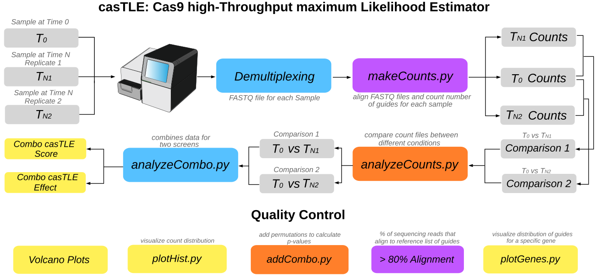

# casTLE: Cas9 high-Throughput maximum Likelihood Estimator




Reference: Morgens, David W., et al. "Systematic comparison of CRISPR/Cas9 and RNAi screens for essential genes." Nature biotechnology 34.6 (2016): 634-636.


## Installation: 
- Please make sure anaconda is installed on your machine. If not, please follow the instructions: 
   ```
   https://docs.conda.io/en/latest/miniconda.html # Link for system-dependent installation of binary 
   cd Downloads # Location where binary (example name Miniconda3-latest-MacOSX-x86_64.sh) is downloaded
   bash Miniconda3-latest-MacOSX-x86_64.sh # Installation of conda
   ```
- Please run the following in order, in the command line: 
   ```
   conda create -name py2 python=2.7
   conda activate py2
   conda install -c bioconda bowtie=1.2.2
   conda install -c bioconda htseq
   conda install -c anaconda scipy=0.19.1
   pip install pp
   ```  
- If all the installations went smoothly, you are ready to run the commands from 'Quick Start'. 

## File Descriptions:
- Scripts/makeIndices.py: Creation of a mapping for all the guides, used by future steps for association to a gene. Not requred if genome-wide alignment is prefered. 
- Scripts/makeCounts.py: Align FASTQ and make count file
- Scripts/analyzeCounts.py: Compares count files using casTLE
- Scripts/analyzeCombo.py: Combines data for two screens
- Scripts/plotGenes_RL.py: Plot guide distrubutions for Genes
- Scripts/addCombo.py: Adds permutations to calculate pvalues
- Scripts/plotDist.py: Visualizes count distribution

## Demultiplexing: 
In order to convert raw data into fastq files, we make use of bcl2fastq, Illumina conversion tool that can be downloaded from [here](https://support.illumina.com/sequencing/sequencing_software/bcl2fastq-conversion-software.html). In order to proceed with using casTLE, the data is required to be in the fastq format. The following script can be used for the conversion: 
```
runName=$1  # path to data directory, e.g., /mnt/lab_data/Sequencing_Data/150312_NS500418_0107_AH5M5HBGXX
runLabel=$2 # path to the location where the output will be saved e.g. /mnt/lab_data/Sequencing_Data/fastq_files/OUT_DIR

seqDir=/mnt/lab_data/bassik/Sequencing_Data/2019/$runName
outDir=/mnt/lab_data/bassik/Sequencing_Data/fastq_files/2019/$runLabel

bcl2fastq \
    --runfolder-dir $seqDir \
    --output-dir $outDir \
    --minimum-trimmed-read-length 17 \
    --mask-short-adapter-reads 0 \
    --barcode-mismatches 0 \
    --stats-dir ./ \
    --reports-dir ./ \
    --ignore-missing-filter \
    --min-log-level WARNING
```


## Quick Start Example: 
- Please activate your conda environment with: 
   ```
   conda activate py2
   ```  
- Please cd inside the downloaded casTLE directory.  
- Inside casTLE, please unzip the directory 'GenRef.zip'
- Creation of an index file: <br />
  Step 1: Please save the index file (in csv format) in the directory 'Align'. <br />
  Step 2: Please run the following command in the command line: <br />
  ```
  python ./Scripts/makeIndices.py -o ./Align/attardi1_align.csv attardi1_align_short attardi1_align_long -t
  ```  
- Run makeCounts.py: <br />
  ```
  python Scripts/makeCounts.py ./Sequencing_Data/220318_RVJS_NucKO_KS_colab/left_flank_S14_L00  Results/left_flank attardi1_align_short   
  python Scripts/makeCounts.py ./Sequencing_Data/220318_RVJS_NucKO_KS_colab/right_flank_S15_L00  Results/right_flank attardi1_align_short 
  python Scripts/makeCounts.py ./Sequencing_Data/220318_RVJS_NucKO_KS_colab/t0_S13_L00  Results/t0 attardi1_align_short 
  python Scripts/makeCounts.py ./Sequencing_Data/220318_RVJS_NucKO_KS_colab/lib_S16_L00  Results/lib attardi1_align_short 
  ``` 
  Note: Ever time makeCounts.py is successfully run, information about alignment quality is reported. For example: 
  ```
  Mapping reads
  # reads processed: 7820356
  # reads with at least one reported alignment: 6628625 (84.76%)
  # reads that failed to align: 1191731 (15.24%)
  ```
  Having an alignment percentage above 80\% is a quick sanity check. Here, 84.76\% re reported (which is good!). 

- Run analyzeCounts.py: (Output will be saved within the directory 'Results') <br />
  ``` 
  python Scripts/analyzeCounts.py ./Data/Results/t0_counts.csv ./Data/Results/right_flank_counts.csv t0_v_right
  python Scripts/analyzeCounts.py ./Data/Results/t0_counts.csv ./Data/Results/left_flank_counts.csv t0_v_left
  python Scripts/analyzeCounts.py ./Data/Results/lib_counts.csv ./Data/Results/t0_counts.csv lib_v_t0
  ``` 
- Run analyzeCombo: (Output will be saved within the directory 'Results') <br />
  ```
  python Scripts/analyzeCombo.py ./Results/t0_v_right.csv  ./Results/t0_v_left.csv combo_left_right
  ```     
- Plot the guides for a particular gene (For example, we will look at the gene SPTAN1): (Output will be saved within the curent working directory) <br />
  ```
  python Scripts/plotGenes_RL.py ./Results/t0_v_left.csv SPTAN1
  ```     
- Run addCombo.py: (Column 'casTLE p-value' will be updated in the combo file of the 'Results' directory)
  ```
  python Scripts/addCombo.py Results/combo_left_right.csv 1000000
  ```     
- Run plotDist.py: (Output will be saved within the directory 'Results') 
  ```
  python Scripts/plotDist.py test_output ./Data/Results/t0_counts.csv ./Data/Results/right_flank_counts.csv
  ```    

## Questions, problems?
Make a github issue 😄. Please be as clear and descriptive as possible. Please feel free to reach
out in person: (TODO: Email)


